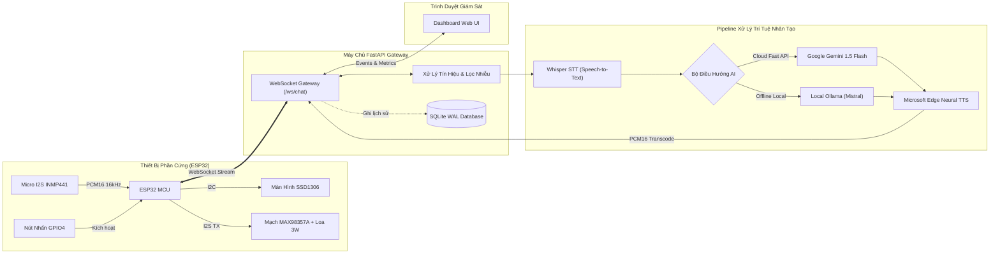

<div align="center">

# 🎙️ Intelligent Communication Device (ICD)
### *Next-Generation Embedded AI Voice Assistant Platform*

[](https://python.org)
[](https://fastapi.tiangolo.com)
[](https://www.espressif.com/)
[](https://github.com/openai/whisper)
[](https://github.com/rany2/edge-tts)
[](LICENSE)

*An end-to-end, production-ready IoT Voice Assistant that connects low-cost ESP32 hardware to a powerful AI pipeline (Whisper STT → Gemini / Ollama LLM → Edge-TTS) over low-latency WebSockets with a real-time monitoring dashboard.*

[Tính Năng](#-tính-năng-nổi-bật) • [Kiến Trúc](#-kiến-trúc-hệ-thống) • [Phần Cứng](#-sơ-đồ-đấu-nối-phần-cứng) • [Cài Đặt Backend](#-hướng-dẫn-cài-đặt-backend) • [Nạp Code ESP32](#-hướng-dẫn-nạp-code-esp32) • [Giao Thức](#-giao-thức-websocket)

---

</div>

## 🌟 Tính Năng Nổi Bật

- **Giao tiếp âm thanh thời gian thực (Real-time Audio Streaming):** Stream âm thanh hai chiều (Full-Duplex I2S) chuẩn PCM 16-bit 16kHz mono qua giao thức WebSocket tối ưu.
- **Hạ tầng AI kép linh hoạt (Dual LLM Engine):**
  - **Google Gemini 1.5 Flash:** Phản hồi siêu tốc qua Cloud REST API, tiêu tốn 0% tài nguyên GPU/VRAM cục bộ.
  - **Ollama (Mistral / Llama 3):** Xử lý ngoại tuyến 100% bảo mật và riêng tư.
  - Tự động chuyển đổi thông minh (Auto-Fallback) và tính toán số học nhanh tại chỗ.
- **Nhận dạng giọng nói tiếng Việt chuẩn xác (Whisper STT):** Sử dụng mô hình OpenAI Whisper đa ngôn ngữ với cơ chế lazy-loading không gây treo hệ thống khi khởi động.
- **Giọng đọc tự nhiên, biểu cảm (Edge Neural TTS):** Tích hợp giọng đọc tiếng Việt truyền cảm từ Microsoft Edge (`vi-VN-HoaiMyNeural` / `vi-VN-NamMinhNeural`).
- **Tối ưu phần cứng ESP32:** Tự động transcode audio TTS từ MP3 sang raw PCM16 16kHz trên máy chủ, giúp ESP32 và mạch DAC MAX98357A phát trực tiếp không cần giải mã phần mềm trên vi điều khiển.
- **Giao diện Web Dashboard thời gian thực:** Giám sát thiết bị online, xem biểu đồ timeline tương tác, nghe lại âm thanh phản hồi và gửi truy vấn test trực tiếp từ trình duyệt.

---

## 🏛️ Kiến Trúc Hệ Thống



---

## 🔌 Sơ Đồ Đấu Nối Phần Cứng

### 1. Bảng Phân Bổ Chân (Pinout Configuration)

> [!IMPORTANT]
> `GPIO 25` (WS/LRC) và `GPIO 26` (SCK/BCLK) là bus xung clock I2S **dùng chung** giữa Microphone và Mạch Loa. Đây là chuẩn thiết kế bus kỹ thuật số của ESP32, không phải xung đột chân.

| Linh kiện ngoại vi | Chân Module | Chân ESP32 DevKit | Điện áp hoạt động | Ghi chú |
|---|---|---|:---:|---|
| **Microphone INMP441** | VDD | **3.3V** | 3.3V | *Không cắm vào 5V* |
| | GND | **GND** | 0V | GND chung toàn mạch |
| | SD | **GPIO 33** | 3.3V | Serial Data ngõ ra của mic |
| | WS | **GPIO 25** | 3.3V | Word Select clock |
| | SCK | **GPIO 26** | 3.3V | Serial Clock |
| | L/R | **GND** | 0V | Kênh trái (Mono audio) |
| **Mạch Loa MAX98357A** | VIN | **5V (MT3608)** | 5.0V | Nguồn công suất loa |
| | GND | **GND** | 0V | GND chung |
| | DIN | **GPIO 27** | 3.3V | Data in cho Amp |
| | LRC | **GPIO 25** | 3.3V | Dùng chung bus với Mic |
| | BCLK | **GPIO 26** | 3.3V | Dùng chung bus với Mic |
| **Màn Hình OLED 0.96" / 1.3"** | VCC | **3.3V** | 3.3V | Nguồn màn hình |
| | GND | **GND** | 0V | GND chung |
| | SDA | **GPIO 21** | 3.3V | Đường dữ liệu I2C |
| | SCL | **GPIO 22** | 3.3V | Đường xung clock I2C |
| **Nút Bấm Ghi Âm** | Chân 1 | **GPIO 4** | 3.3V | Sử dụng `INPUT_PULLUP` nội |
| | Chân 2 | **GND** | 0V | Nhấn nút = Kéo về LOW |

### 2. Sơ Đồ Khối Cấp Nguồn An Toàn

```text
Pin 18650 (3.7V) ──> TP4056 (Sạc Type-C) ──> Công Tắc ON/OFF ──> Mạch Boost MT3608 (Chỉnh đúng 5.0V)
                                                                            │
                       ┌────────────────────────────────────────────────────┴────────────────┐
                       ▼                                                                     ▼
               ESP32 (Chân VIN)                                                     MAX98357A (Chân VIN 5V)
                       │                                                                     │
               (Tụ lọc 1000µF 16V) ──────────────────────────────────────────────────────────┘
```

> [!CAUTION]
> Luôn đo điện áp ngõ ra của mạch boost MT3608 bằng đồng hồ vạn năng đạt **chuẩn 5.0V** trước khi gắn vào ESP32. Bắt buộc gắn thêm **tụ hóa 470µF - 1000µF (16V)** song song với nguồn 5V để chống sụt áp gây reset ESP32 khi loa phát lớn.

---

## 💻 Hướng Dẫn Cài Đặt Backend

### 1. Yêu Cầu Tiên Quyết
- **Python 3.10** trở lên.
- **FFmpeg** đã cài đặt và cấu hình biến môi trường `PATH` (hỗ trợ chuyển đổi audio).

### 2. Cài Đặt Môi Trường
```bash
# Di chuyển vào thư mục backend
cd BE

# Khởi tạo môi trường ảo Python
python -m venv venv

# Kích hoạt môi trường ảo:
# Trên Windows PowerShell:
.\venv\Scripts\Activate.ps1
# Trên Linux/macOS:
source venv/bin/activate

# Cài đặt các gói phụ thuộc
pip install -r requirements.txt
```

### 3. Cấu Hình Biến Môi Trường (`.env`)
Sao chép file mẫu `.env.example` thành `.env`:
```bash
cp .env.example .env
```
Mở file `.env` và tùy chỉnh các thông số mong muốn:
```ini
HOST=0.0.0.0
PORT=8000
LOG_LEVEL=INFO

# Lựa chọn LLM: "auto", "gemini", hoặc "ollama"
LLM_PROVIDER=auto

# Cấu hình Google Gemini (Khuyên dùng - phản hồi nhanh, miễn phí)
GEMINI_API_KEY=your_gemini_api_key_here
GEMINI_MODEL=gemini-1.5-flash

# Cấu hình Ollama (nếu dùng máy chủ AI offline cục bộ)
OLLAMA_BASE_URL=http://localhost:11434
OLLAMA_MODEL=mistral

# Mô hình Whisper: tiny, base, small, medium, large-v3 (Mặc định: base)
WHISPER_MODEL=base

# Giọng đọc tiếng Việt Microsoft Edge
TTS_VOICE=vi-VN-HoaiMyNeural
```

### 4. Khởi Động Server
```bash
uvicorn main:app --host 0.0.0.0 --port 8000 --reload
```
- **Dashboard Web UI:** `http://localhost:8000`
- **Tài liệu API Swagger:** `http://localhost:8000/docs`
- **Kiểm tra trạng thái:** `http://localhost:8000/health`

---

## 📟 Hướng Dẫn Nạp Code ESP32

### 1. Chuẩn Bị Thư Viện (Arduino IDE / PlatformIO)
Cài đặt các thư viện sau từ Arduino Library Manager:
- `ArduinoWebsockets` (by Gil Maimon)
- `ArduinoJson` (v6 hoặc v7 by Benoit Blanchon)
- `Adafruit SSD1306` & `Adafruit GFX Library`

### 2. Cấu Hình Thông Tin Mạng & Server
Mở file `ESP32_ICD/ESP32_ICD.ino`, tìm phần cấu hình ở đầu file và thay đổi:
```cpp
const char* WIFI_SSID = "Tên_WiFi_Của_Bạn";
const char* WIFI_PASS = "Mật_Khẩu_WiFi";

// Thay đổi theo địa chỉ IP máy tính chạy backend của bạn
const char* WS_URL    = "ws://192.168.1.15:8000/ws/chat?type=esp32";
```

### 3. Nạp Code & Kiểm Tra
1. Chọn Board: **ESP32 Dev Module**.
2. Chọn đúng Cổng COM kết nối.
3. Nhấn **Upload** để nạp chương trình.
4. Mở **Serial Monitor** với tốc độ `115200 baud` để quan sát log kết nối WiFi và WebSocket.

---

## 📡 Giao Thức WebSocket (`/ws/chat`)

Hệ thống hỗ trợ 2 loại client kết nối:
1. `?type=esp32` (Dành cho phần cứng ESP32)
2. `?type=browser` (Dành cho Dashboard web giám sát)

### Chu Trình Sự Kiện (Event Lifecycle)

| Bên gửi | Dạng gói tin | Tên Event / Dữ liệu | Mục đích |
|---|---|---|---|
| **ESP32** | Binary | `Raw PCM16 bytes` | Stream audio 512 mẫu/gói ghi từ microphone |
| **ESP32** | JSON | `{"event": "reset"}` | Xóa buffer audio cũ trước khi thu mới |
| **ESP32** | JSON | `{"event": "end"}` | Báo hiệu kết thúc thu âm, bắt đầu xử lý |
| **Server** | JSON | `{"event": "processing"}` | Báo cho thiết bị biết AI đang chạy pipeline |
| **Server** | JSON | `{"event": "transcript", "text": "..."}` | Trả về nội dung người dùng vừa nói |
| **Server** | JSON | `{"event": "assistant_text", "text": "..."}` | Trả về câu trả lời của trợ lý AI |
| **Server** | JSON | `{"event": "tts_start", "size": N, "format": "pcm"}` | Báo hiệu sắp stream audio phản hồi |
| **Server** | Binary | `Raw PCM16 Chunks` | Dữ liệu âm thanh tiếng nói gửi cho ESP32 phát qua loa |
| **Server** | JSON | `{"event": "tts_end"}` | Kết thúc chu trình, quay về trạng thái Standby |

---

## 📂 Cấu Trúc Dự Án (Repository Structure)

```text
├── .gitignore                   # Chặn file tạm, thư mục test, db, venv
├── .env.example                 # Mẫu cấu hình môi trường chuẩn
├── README.md                    # Tài liệu hướng dẫn chính thức dự án
├── BE/                          # Mã nguồn Backend FastAPI
│   ├── main.py                  # Điểm khởi chạy ứng dụng & WebSocket Gateway
│   ├── config.py                # Quản lý cấu hình tập trung
│   ├── requirements.txt         # Danh sách thư viện Python
│   ├── .env.example             # Mẫu biến môi trường cho BE
│   ├── services/
│   │   ├── __init__.py
│   │   ├── ai_service.py        # Dịch vụ AI (Whisper STT, Gemini, Ollama, Edge-TTS)
│   │   └── audio_processing.py  # Xử lý âm thanh, lọc nhiễu, chuyển đổi PCM/WAV
│   └── static/
│       └── index.html           # Giao diện Web Dashboard thời gian thực
└── ESP32_ICD/                   # Mã nguồn Firmware & Tài liệu phần cứng
    ├── ESP32_ICD.ino            # Firmware hoàn chỉnh cho ESP32
    └── HUONG_DAN_LAP_DAT_ICD.md # Cẩm nang hướng dẫn đấu nối & đo đạc phần cứng
```

---

## 🤝 Đóng Góp & Giấy Phép (License)

Dự án được phân phối dưới giấy phép [MIT License](LICENSE). Mọi đóng góp, báo cáo lỗi hoặc đề xuất tính năng mới đều được hoan nghênh qua GitHub Issues và Pull Requests!